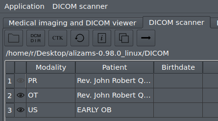

Aliza MS - DICOM Viewer
=======================

Quick start
-----------

Select 'DICOM scanner' tab, open directory with DICOM files or DICOMDIR file (or drag-and-drop)

Select one or more series and click 'arrow' action (or double-click selected row) to load

Features
--------
 * Directory scanner
 * DICOMDIR
 * 3D views with many tools
 * View non-uniform series in physical space
 * 2D+t, 3D+t animation
 * Intersections in study
 * Ultrasound incl. proper measurement in regions, cine
 * Contours (RTSTRUCT contours
 * Siemens Mosaic format
 * United Imaging Healthcare (UIH) Grid / VFrame format
 * Elscint ELSCINT1 PMSCT_RLE1 and PMSCT_RGB1
 * DICOM Structured Report browser (WIP)
 * etc.
