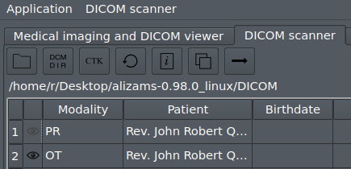

Aliza MS - DICOM Viewer
=======================

Quick start
-----------

Linux
-----

To start on Linux extract archive and run _alizams.sh_

```
cd alizams-1.1.0_linux
./alizams.sh
```

Optionally install local desktop menu entry

```
cd alizams-1.1.0_linux/install_menu
./install_menu.sh
```

To remove local menu entry

```
cd alizams-1.1.0_linux/install_menu
./uninstall_menu.sh
```

Windows
-------

Extract archive, click or run from terminal _alizams.exe_

View
----

Select _DICOM scanner_ tab, open directory with DICOM files or DICOMDIR file (or drag-and-drop)

Select one or more series and click _arrow_ action (or double-click selected row) to load





Highlights
----------

 * Very fast directory scanner, DICOMDIR
 * 2D and 3D views with many tools
 * View uniform and non-uniform series in physical space
 * 2D+t, 3D+t animations
 * Ultrasound incl. proper measurement in regions, cine
 * Scout (localizer) lines
 * Grayscale softcopy presentation
 * Structured report
 * Compressed images
 * RTSTRUCT contours
 * Siemens mosaic format
 * United Imaging Healthcare (UIH) Grid / VFrame format
 * Elscint ELSCINT1 PMSCT_RLE1 and PMSCT_RGB1
 * DICOM metadata
