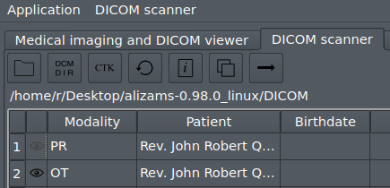

Aliza MS - DICOM Viewer
=======================

Get
---

See latest release: [Releases](https://github.com/AlizaMedicalImaging/AlizaMS/releases)

S. [www.aliza-dicom-viewer.com](https://www.aliza-dicom-viewer.com) for other operating systems and versions.

Quick start
-----------

Select _DICOM scanner_ tab, open directory with DICOM files or DICOMDIR file (or drag-and-drop).

Select one or more series and click _arrow_ action (or double-click selected row) to load.

View short introductory videos on [Youtube Channel](https://www.youtube.com/channel/UCPGvoSYX7PC5XCp-81Q4MAg) _(new, WIP)_

Recommendations
---------------

* Adjust application font size and icons size in _Settings->Application_
* Press *f* (having focus in 2D view) to fit the image size
* Press *s* (having focus in 2D view) to toggle smoothing
* Press *g* (2D or 3D view) to save screenshot of the view
* Try to enable linear filtering for 3D view in _Settings->3D_
    - Restart is not required, will be applicable to the next opened image
    - Note: this slightly alters the image; if the distance between slices is large, it can lead to the appearance of artifacts
* Try _Show frames_ option (lower panel) in _3D Physical Space View_, specially for non-uniform images

Highlights
----------

 * 2D and 3D views with many tools
 * 3D view also for non-uniform images
 * Volume Rendering
 * Multi-planar reconstruction (MPR)
 * Fast directory scanner, DICOMDIR
 * Consistently de-identify DICOM, maintain integrity
 * RTSTRUCT contours
 * DICOM Study multi-view with intersection lines and side-by-side view
 * Proper measurement in Ultrasound Calibrated Regions
 * 2D+t and 3D+t animations
 * DICOM metadata viewer, DICOM 2026b dictionary
 * Encapsulated transfer syntaxes incl. HTJ2K
 * Most IODs are supported incl. Structured Reports, Key Objects Selection, Grayscale Softcopy Presentation State</li>

Build
-----

 * S.  for example how to build on Linux.

