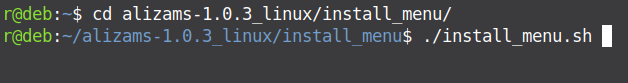

Aliza MS - DICOM Viewer
=======================

Quick start
-----------

Linux
-----

To start on Linux extract archive and run _alizams.sh_

Optionally install local desktop menu entry

Windows
-------

Click or run from terminal _aliza.exe_

View
----

Select 'DICOM scanner' tab, open directory with DICOM files or DICOMDIR file (or drag-and-drop)

Select one or more series and click 'arrow' action (or double-click selected row) to load

Highlights
----------
 * View non-uniform series in physical space
 * Ultrasound incl. proper measurement in regions, cine
 * Intersections in study
 * 2D+t, 3D+t animations
 * Very fast directory scanner, DICOMDIR
 * Compressed images
 * RTSTRUCT contours
 * 2D and 3D views with many tools
 * Siemens Mosaic format
 * United Imaging Healthcare (UIH) Grid / VFrame format
 * Elscint ELSCINT1 PMSCT_RLE1 and PMSCT_RGB1
 * Grayscale softcopy presentation (partial)

Build
-----

[Linux example](https://github.com/AlizaMedicalImaging/AlizaMS/wiki)

